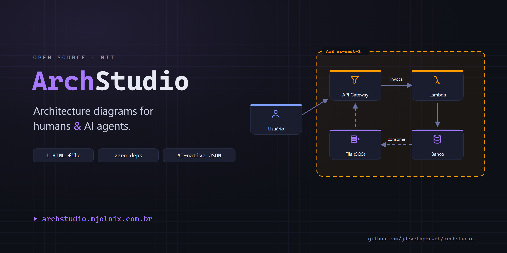
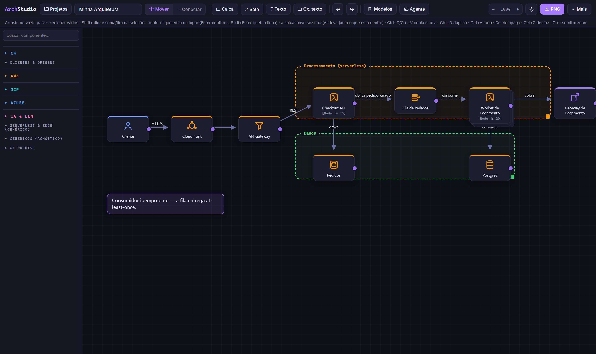
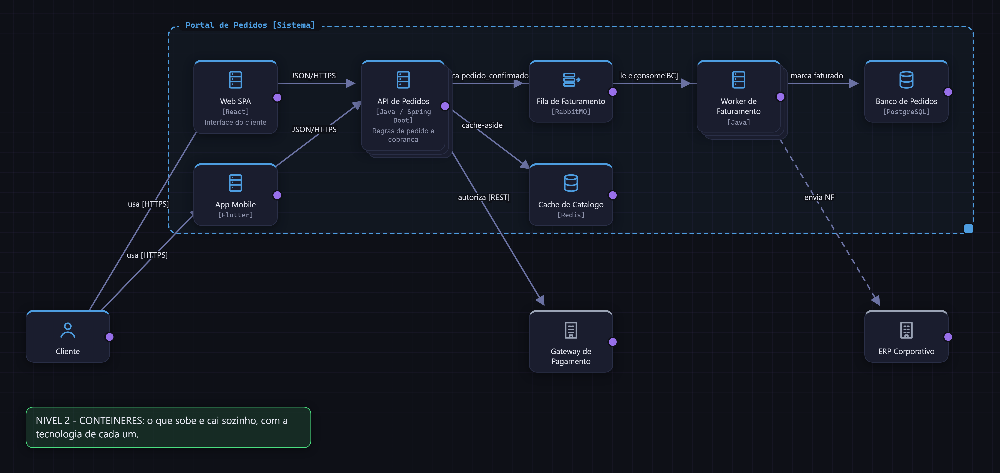
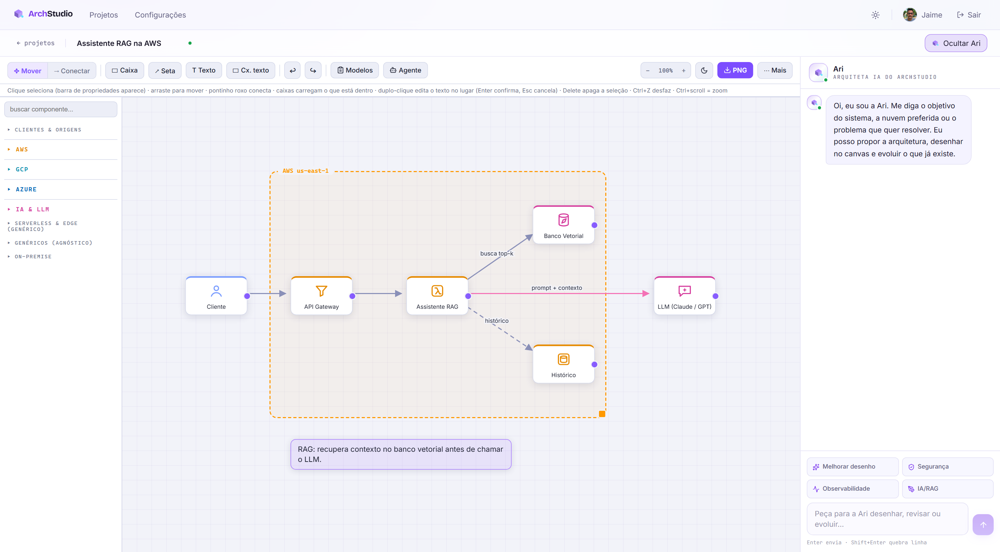
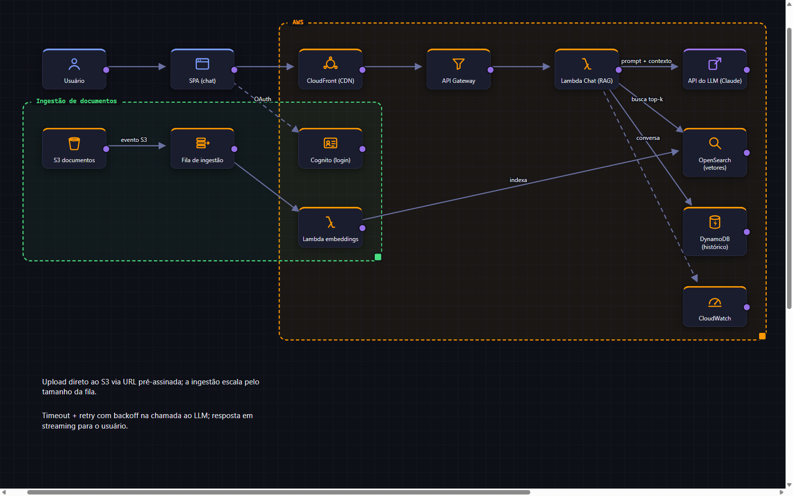

<p align="center">
  
</p>

<h1 align="center">ArchStudio</h1>

<p align="center">
  Um editor de <strong>diagramas de arquitetura de software</strong> que cabe em <strong>um único arquivo HTML</strong> — feito para humanos <em>e</em> para agentes de IA desenharem juntos.
  <br>
  Vem em duas formas: o <strong>canvas</strong> (um <code>index.html</code>, zero dependências) e a <strong>plataforma</strong> completa com contas, projetos e a <strong>Ari</strong>, uma assistente de IA que projeta e <em>desenha</em> no canvas.
</p>

<p align="center">
  
  
  
  
</p>

<p align="center">
  
</p>

---

## O que é

ArchStudio é um canvas que **fala JSON**. Você (ou seu agente de IA) descreve o sistema como uma pequena _spec_, e o app organiza o layout, desenha num estilo visual caprichado e exporta. Não precisa de conta, build nem servidor: o editor inteiro é [`index.html`](index.html) e funciona offline.

Quando você quer contas, projetos salvos na nuvem e uma IA desenhando ao seu lado, existe a **plataforma** — a mesma engine de canvas embutida num produto Next.js + Spring Boot + Postgres, tudo containerizado. As duas formas convivem: o `index.html` continua sendo um arquivo só.

## Destaques

- **Um arquivo, zero dependências** — o app inteiro (CSS + HTML + JS) vive em [`index.html`](index.html). Baixou, abriu no navegador, pronto. Funciona offline (a única rede é o Google Fonts).
- **Auto-layout** — descreva nós e setas e **omita `x`/`y`**; o app arruma o fluxo da esquerda para a direita. Agentes nunca calculam coordenadas.
- **Nativo para IA** — a spec é um JSON compacto. O botão **Agente** entrega o schema para qualquer LLM; a skill de Claude Code desenha e ainda **renderiza um PNG para conferir** antes de te entregar.
- **Modelo C4** — notação C4 (Contexto, Contêineres, Componentes) **por cima** do catálogo, sem substituir nada: qualquer componente aceita `[tecnologia]` e uma descrição, há um grupo C4 na paleta, a caixa de fronteira mantém sistemas externos do lado de fora, e há 3 modelos prontos.
- **Setas do jeito que você precisa** — várias conexões entre o mesmo par (separadas lado a lado), traçado **reto / curvo / ângulo reto**, e **pontos de controle** arrastáveis para desenhar o caminho.
- **Fixar e girar** — trave um item (não move, não copia, não apaga, o laço não pega) e gire qualquer componente, caixa ou texto (livre ou preso ao ímã da grade, de 15 em 15°).
- **Cartão "múltiplos"** — marque um componente como várias instâncias (réplicas, pods, workers) e ele vira uma pilha.
- **Links compartilháveis** — o diagrama inteiro é codificado na URL (`#d=…`). Manda o link, recebe um diagrama editável.
- **Diagrama → Infraestrutura como Código** — a partir do desenho validado, um clique empacota um prompt que faz o agente gerar **AWS CDK (TypeScript)** ou **Terraform**, derivando IAM de menor privilégio e o _wiring_ de eventos **a partir das setas**.
- **Paleta com 100+ componentes** — AWS, GCP e Azure organizados por área (rede, computação, dados, mensageria, segurança, IA), uma seção completa de **IA & LLM** (pipeline de RAG, orquestração de agentes, RAGAS, guardrails) e genéricos/serverless/on-premise.
- **14 modelos de solução** — Cache-Aside, Fila + Worker, Outbox, Circuit Breaker, CQRS, Saga, BFF, pipeline serverless, Strangler Fig, Bulkhead, ingestão com ordem por chave, híbrido on-prem ↔ nuvem, RAG completo e orquestração multi-agente — cada um com _problema_, _por que o padrão resolve_ e _quando usar_.
- **Exportar** — PNG (2×) e SVG com fontes embutidas, com opções de **grade, título e fundo transparente**; salvar/carregar como `.archstudio.json`.
- **Conforto de edição** — arrastar e conectar, caixas que agrupam, undo/redo, ímã de grade, zoom, tema claro/escuro, 7 fontes (incluindo rascunho à mão), copiar/colar/duplicar, edição de rótulo no próprio item (sem `prompt()` do navegador).
- **Visão limpa** — some `&view=clean` a um link e a interface desaparece com zoom ajustado ao conteúdo: feito para screenshot headless, embed e revisão visual instantânea.

## Rodar localmente

Há dois caminhos, do mais simples ao mais completo.

### Opção 1 — só o canvas (um arquivo, zero setup)

É a forma recomendada para desenhar. Não precisa instalar nada.

```bash
git clone <url-do-repo> archstudio
cd archstudio
# abra index.html no navegador — esse é o "install" inteiro
```

No Windows: `start index.html` · macOS: `open index.html` · Linux: `xdg-open index.html`.

Tudo é local no seu navegador: cada diagrama é um espaço isolado (gerenciado pelo botão **Projetos**), nada sai da sua máquina e não há conta. Os recursos de IA (**Agente**) apenas copiam um prompt para você colar num chat — não há servidor envolvido.

### Opção 2 — a plataforma completa (contas + Ari + banco)

Sobe **Postgres + API (Java) + Web (Next.js)** com um comando. Requer apenas **Docker** e **Docker Compose** — nenhum Java, Node ou Postgres instalado na máquina.

```bash
cd infra
bash deploy.sh        # gera os segredos em infra/.env, builda e sobe db + api + web
```

Ao terminar, acesse **http://localhost:3020**. O que o script faz:

1. cria `infra/.env` a partir do exemplo e **gera os segredos** (`APP_JWT_SECRET`, `APP_ENC_KEY`, `POSTGRES_PASSWORD`) com `openssl`;
2. `docker compose up -d --build` para os três serviços;
3. espera a API responder em `/actuator/health`.

Portas (presas em `127.0.0.1`): web **3020**, api **8090**. O Postgres fica só na rede interna do Docker. O schema é criado pelo **Flyway** na subida (`V1__init.sql`, `V2__user_avatar.sql`).

**E-mail de confirmação:** por padrão `MAIL_ENABLED=false` — os links de verificação/reset são **impressos no log da API** (ótimo para rodar local):

```bash
cd infra && docker compose logs -f api | grep -i mail
```

Para e-mail de verdade, preencha `MAIL_*` em `infra/.env` e ligue `MAIL_ENABLED=true`.

**Publicar com domínio + HTTPS (opcional):** há um exemplo de nginx em [`infra/nginx/`](infra/nginx/). Aponte um `A` record para o servidor, instale o `.conf` em `/etc/nginx/conf.d/` e rode `certbot --nginx`. Deixe `APP_COOKIE_SECURE=true` e ajuste `APP_PUBLIC_URL` no `.env`.

Comandos úteis:

```bash
cd infra
docker compose ps                      # status
docker compose logs -f api             # logs da API
docker compose down                    # parar (mantém o volume do banco)
docker compose up -d --build web       # rebuildar só o web
```

### Requisitos

| Caminho | Precisa de |
|---|---|
| Canvas (Opção 1) | Um navegador. Só isso. |
| Plataforma via Docker (Opção 2) | Docker + Docker Compose · `openssl` (para o `deploy.sh`) |
| Desenvolvimento sem Docker | Java 17 + Maven · Node 18+ · Postgres 16 |

**Dev sem Docker:**

```bash
# API (precisa de um Postgres local ou aponte SPRING_DATASOURCE_URL para um)
cd services/api && mvn spring-boot:run

# Web — o canvas é copiado para dentro do public/ e servido junto
cd apps/web
cp ../../index.html public/canvas/index.html
npm install && npm run dev
# rode a API com APP_COOKIE_SECURE=false e aponte API_INTERNAL_URL=http://localhost:8090
```

## Como usar o editor

O básico é arrastar da paleta para o canvas e conectar. Gestos e atalhos:

| Ação | Como |
|---|---|
| Adicionar componente | clique na paleta à esquerda (busque pelo nome) |
| Conectar | modo **Conectar** e clique em dois componentes, ou arraste da **bolinha** de um até o outro |
| Selecionar vários | arraste no vazio (laço) · **Shift+clique** soma/tira da seleção · **Ctrl+A** seleciona tudo |
| Mover em grupo | selecione e arraste; a **caixa** move sozinha (**Alt** leva junto o que está dentro) |
| Editar rótulo/nome | **duplo-clique** no item (Enter confirma, Shift+Enter quebra linha) |
| Copiar / colar / duplicar | **Ctrl+C** / **Ctrl+V** / **Ctrl+D** |
| Curvar uma seta | selecione e **arraste a linha** (cria um ponto de controle); duplo-clique na bolinha remove |
| Traçado da seta | selecione a seta → botão de traçado (reto / curvo / ângulo reto) |
| Fixar / girar | painel do item: **fixar** trava a posição; a alça **⟲** gira (ímã da grade trava de 15°) |
| Apagar · desfazer | **Delete** · **Ctrl+Z** / **Ctrl+Y** |
| Zoom | **Ctrl+scroll** |
| Exportar | **PNG** na barra, ou **Mais → Exportar SVG** (grade/título/fundo são opções no menu) |

## Modelo C4

C4 aqui é **notação, não um catálogo à parte**. Você continua com todo o catálogo de nuvem — e ganha a semântica C4 por cima: qualquer componente (até um `lambda` ou um `rds`) aceita `[tecnologia]` e descrição, então dá para desenhar C4 já mostrando a stack real.

<p align="center">
  
</p>

Faça **um diagrama por nível** (o botão **Modelos** traz os três prontos):

- **Nível 1 — Contexto:** pessoas + seu sistema + sistemas externos. Sem tecnologia interna.
- **Nível 2 — Contêineres:** o que sobe e cai sozinho (SPA, API, banco, fila), cada um com a tecnologia. Marque réplicas como **múltiplos**.
- **Nível 3 — Componentes:** por dentro de um contêiner; o que é externo a ele aparece na borda.

Ponha o que é do escopo numa **caixa** (a fronteira) e deixe pessoas e sistemas externos fora dela — o auto-layout dá uma faixa própria a cada fronteira, então externos nunca caem para dentro.

## Trabalhando com agentes de IA

ArchStudio trata agentes como usuários de primeira classe. Três formas de plugar um:

### 1 · Claude Code (recomendado)

O repositório traz uma skill em [`.claude/skills/archstudio/SKILL.md`](.claude/skills/archstudio/SKILL.md). Abra o repo no [Claude Code](https://claude.com/claude-code) e peça:

> _"Desenhe a arquitetura de um checkout de e-commerce com fallback de pagamento."_

Ele escreve a spec `.archstudio.json`, **renderiza um PNG do diagrama no próprio chat** (e confere antes de entregar) e devolve um link que abre o diagrama editável. Para usar a skill em qualquer projeto, copie a pasta para `~/.claude/skills/archstudio/`.

### 2 · Qualquer LLM pelo modo Agente

Clique em **Agente** no app, copie o schema, cole em qualquer chat ("desenhe minha arquitetura neste formato"), salve a resposta como `.json` e carregue por **Mais → Carregar** — ou pule o arquivo com um link (abaixo).

### 3 · Links e carregamento por URL

| URL | O que faz |
|---|---|
| `…/#d=z:<base64url>` | Abre um diagrama comprimido (deflate-raw), o que o botão de link gera |
| `…/#d=j:<base64url>` | Abre um JSON em base64url puro — trivial para um agente emitir |
| `…/?src=<url>` | Busca um JSON cru (ex.: um gist) e renderiza |
| `…&view=clean` (após `#d=…`) | Esconde a interface e ajusta o zoom — feito para screenshot headless |

Gerar um link a partir de um arquivo de spec, em uma linha:

```bash
node -e "console.log('http://localhost:8080/index.html#d=j:'+Buffer.from(require('fs').readFileSync(process.argv[1])).toString('base64url'))" diagram.archstudio.json
```

### A Ari, na plataforma

Na plataforma, a **Ari** é um painel lateral no editor que discute trade-offs e **desenha no canvas**. Descreva um sistema e veja aparecer; ela edita **incrementalmente** — preserva seu layout, muda só o que precisa e anima as partes novas. Você usa **sua própria chave** de API (OpenAI, Anthropic/Claude, Google/Gemini, Groq, Mistral, DeepSeek, OpenRouter ou qualquer endpoint compatível com OpenAI, como Ollama), guardada **criptografada (AES-256-GCM)**.

<p align="center">
  
</p>

## Do diagrama ao IaC

O diagrama validado não é só uma figura — é um plano legível por máquina. Dentro do modo **Agente** há dois botões: **prompt de AWS CDK (TypeScript)** e **prompt de Terraform**. Cada um copia um pacote completo (instruções + seu diagrama em JSON) para colar em qualquer agente, que então:

1. mapeia cada nó ao recurso equivalente (`apigw` → API Gateway, `lambda` → Lambda, `dlq` → dead-letter queue com redrive, …);
2. lê as **setas como wiring e IAM de menor privilégio** — `api → fila` vira um grant de envio, `fila → worker` vira um event source mapping, setas tracejadas viram caminhos assíncronos;
3. trata nós de cliente/on-premise como contexto (não recursos) e suas anotações de `texts` como requisitos;
4. entrega um projeto compilável mais duas listas curtas: _decisões assumidas_ e _o que precisa de um humano_ (domínios, segredos, tamanhos).

Com Claude Code é ainda mais curto: _"gere o CDK do examples/rag-serverless-aws.archstudio.json"_ — a skill conhece a tabela de mapeamento inteira.

<p align="center">
  
  <br>
  <em>Desenhado por um agente a partir de <a href="examples/rag-serverless-aws.archstudio.json">uma spec JSON</a>, renderizado headless com <code>&view=clean</code> — nenhum humano arrastou uma caixa.</em>
</p>

## Formato da spec

Agentes (e humanos) descrevem diagramas assim — **omita `x`/`y` e o auto-layout arruma o fluxo**:

```json
{
  "name": "Checkout resiliente",
  "boxes": [ { "id": "aws", "label": "AWS us-east-1", "color": "#ff9900" } ],
  "nodes": [
    { "id": "u",   "type": "user" },
    { "id": "api", "type": "api",   "label": "Checkout API", "box": "aws", "tech": "Spring Boot" },
    { "id": "q",   "type": "queue", "label": "Fila de pedidos", "box": "aws" },
    { "id": "db",  "type": "db",    "label": "Postgres", "box": "aws" }
  ],
  "edges": [
    { "from": "u",   "to": "api" },
    { "from": "api", "to": "q",  "label": "202 Accepted" },
    { "from": "q",   "to": "db", "dash": true }
  ],
  "texts": [ { "text": "Consumidor idempotente — a fila entrega at-least-once." } ]
}
```

- Schema JSON completo: [`schema/archstudio.schema.json`](schema/archstudio.schema.json)
- Exemplos prontos para carregar: [`examples/`](examples/)
- Campos extra por nó: `tech`, `desc`, `multiple`, `color`, `lock`, `rot`, `style` (`card`/`icon`), `s` (escala)
- Campos por aresta: `label`, `dash`, `heads` (`end`/`both`/`none`), `route` (`reta`/`curva`/`orto`), `color`, `w`
- 100+ tipos (`user`, `api`, `queue`, `lambda`, `cloudrun`, `cosmosdb`, `retriever`, `reranker`, `ragas`, `orchestrator`, `mcp`, `c4container`, `mainframe`, …) — listados no schema e no modo Agente

## Modelos prontos

Cada modelo responde três perguntas antes de tocar o canvas: **qual problema**, **por que este padrão resolve** e **onde se aplica**.

| Padrão | Categoria |
|---|---|
| C4 — Contexto / Contêineres / Componentes | Modelagem |
| Cache-Aside | Performance |
| Fila + Worker (nivelamento de carga) | Resiliência |
| Outbox (dual-write) | Consistência |
| Circuit Breaker + Fallback | Resiliência |
| CQRS + Read Model | Escala |
| Saga coreografada | Sistemas distribuídos |
| API Gateway + BFF | Design de API |
| Pipeline serverless de mídia | Serverless |
| Strangler Fig | Migração |
| Bulkhead (filas por prioridade) | Resiliência |
| Ingestão com ordem por chave | Mensageria |
| Híbrido on-premise ↔ nuvem | Híbrido |
| RAG completo (ingestão → consulta → RAGAS) | IA / RAG |
| Orquestração multi-agente | IA / Agentes |

## Estrutura do repositório

```
index.html                     # o canvas inteiro — um arquivo, zero dependências
schema/archstudio.schema.json  # o formato da spec (JSON Schema)
examples/                      # diagramas prontos (.archstudio.json)
.claude/skills/archstudio/     # skill de Claude Code: desenhar + gerar IaC
tools/check_no_emoji.py        # trava: nada de emoji na interface (ícones são SVG)

apps/web/                      # plataforma — front Next.js 14 + Tailwind
services/api/                  # plataforma — API Spring Boot 3 / Java 17
infra/                         # docker-compose, deploy.sh, .env.example, nginx
platform/CONTRACT.md           # contrato de API/DB/auth da plataforma
```

## Segurança (plataforma)

Senhas com **BCrypt(12)** · sessão em cookie **httpOnly + SameSite** · verificação de e-mail · **rate limiting** por IP/usuário · checagem de **CSRF** em mutações · chaves de provedor **criptografadas em repouso (AES-256-GCM)** · **guarda anti-SSRF** no endpoint de IA custom · headers **HSTS/CSP** · exclusão de conta exige a senha · cada usuário só vê os próprios projetos. Detalhes em [`platform/CONTRACT.md`](platform/CONTRACT.md).

## Licença

[MIT](LICENSE) © Jaime Vicente Jr.
