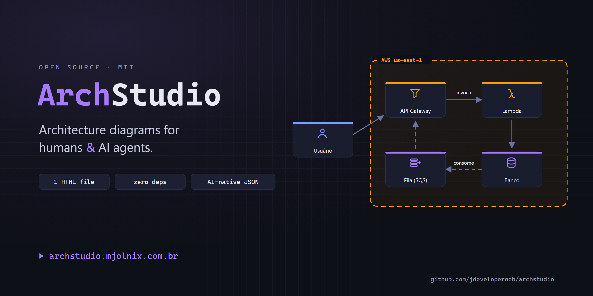
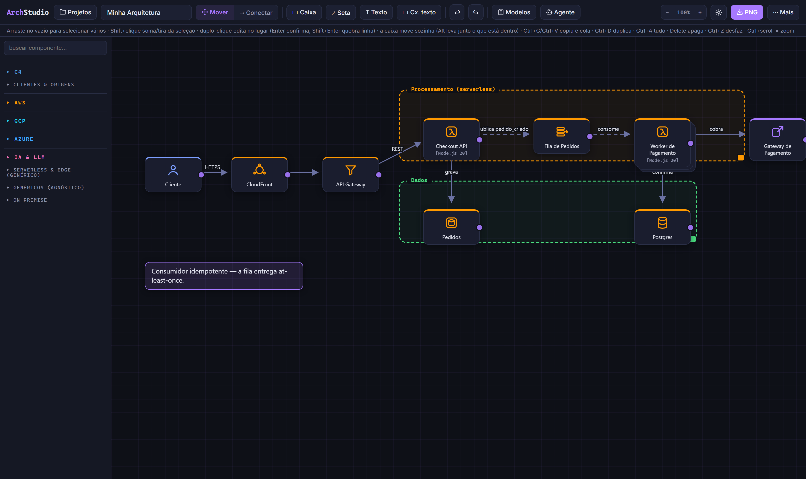
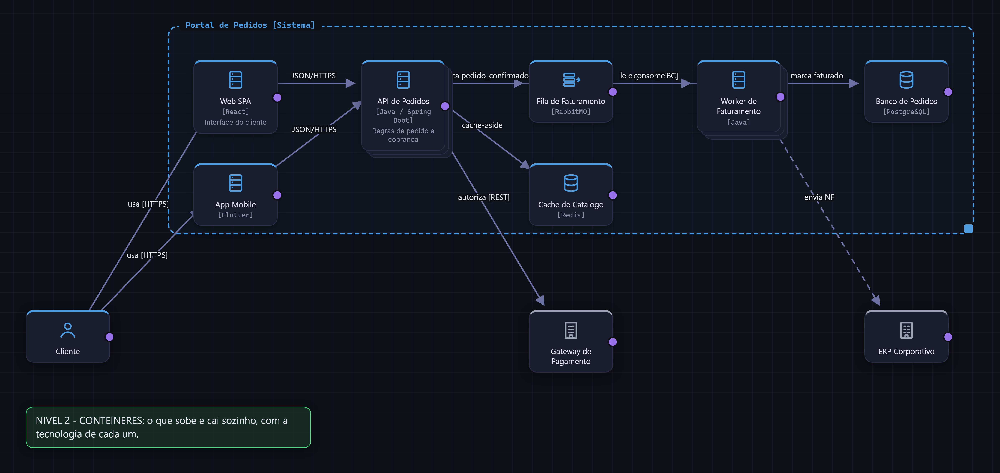

<p align="center">
  
</p>

<h1 align="center">ArchStudio</h1>

<p align="center">
  Editor de <strong>diagramas de arquitetura de software</strong> que cabe em <strong>um único arquivo HTML</strong>.
  <br>
  Sem build, sem dependências, sem conta, sem servidor. Baixou, abriu no navegador, desenhou.
</p>

<p align="center">
  <a href="https://archstudio.mjolnix.com.br"></a>
  
  
</p>

<p align="center">
  
</p>

## Comece agora

**Sem instalar nada:** abra <https://archstudio.mjolnix.com.br>.

**Local:**

```bash
git clone https://github.com/jdeveloperweb/archstudio.git
cd archstudio
# abra index.html no navegador. Esse é o "install" inteiro.
```

Windows: `start index.html` · macOS: `open index.html` · Linux: `xdg-open index.html`

Tudo acontece no seu navegador. Cada diagrama é um espaço isolado (botão **Projetos**), nada sai da sua máquina e não existe conta.

## Por que existe

A maioria dos editores de diagrama pede muito antes de deixar você pensar: instalação, login, uma biblioteca de formas genéricas. Quando o assunto é desenho de sistemas, o atrito aparece justamente na hora de raciocinar.

O ArchStudio nasceu do estudo de System Design com uma regra: o arquivo tem que abrir e desenhar. O resultado é um canvas que **fala JSON** e organiza o layout sozinho.

## O que ele faz

**Um arquivo, zero dependências.** CSS, HTML e JS vivem em [`index.html`](index.html). Funciona offline (a única rede é a fonte do Google).

**Auto-layout.** Descreva nós e setas e **omita `x`/`y`**: o app arruma o fluxo da esquerda para a direita. Você nunca calcula coordenadas.

**Catálogo com mais de 100 componentes.** AWS, GCP e Azure organizados por área (rede, computação, dados, mensageria, segurança), além de genéricos, serverless, on-premise e uma seção de IA e LLM.

**Modelo C4 por cima do catálogo.** Qualquer componente aceita `[tecnologia]` e descrição; há grupo C4 na paleta, caixa de fronteira para manter sistemas externos do lado de fora, e modelos prontos de Contexto, Contêineres e Componentes.

**Conexões que obedecem.** Várias setas entre o mesmo par sem sobrepor, traçado reto, curvo ou em ângulo reto, e pontos de controle arrastáveis.

**14 modelos de solução.** Cache-Aside, Fila com Worker, Outbox, Circuit Breaker, CQRS, Saga, BFF, pipeline serverless, Strangler Fig, Bulkhead, ingestão com ordem por chave, híbrido on-premise com nuvem, RAG e orquestração multi-agente. Cada um explica o problema, por que o padrão resolve e quando usar.

**Links compartilháveis.** O diagrama inteiro é codificado na URL (`#d=…`): mande o link, a pessoa recebe um diagrama editável.

**Exportar.** PNG em 2x e SVG com fontes embutidas, com opções de grade, título e fundo transparente. Salvar e carregar como `.archstudio.json`.

**Conforto de edição.** Arrastar e conectar, caixas que agrupam, undo e redo, ímã de grade, zoom, tema claro e escuro, sete fontes (inclusive rascunho à mão), copiar, colar, duplicar, fixar e girar itens.

**Visão limpa.** Some `&view=clean` ao link e a interface some, com zoom ajustado ao conteúdo. Feito para captura headless, incorporação e revisão visual.

<p align="center">
  
</p>

## O formato da spec

Um diagrama é um JSON pequeno. Este exemplo já é um diagrama válido:

```json
{
  "version": 3,
  "name": "Pedido assíncrono",
  "nodes": [
    { "id": "api", "type": "api", "label": "API de Pedidos" },
    { "id": "fila", "type": "sqs", "label": "Fila" },
    { "id": "worker", "type": "lambda", "label": "Worker" }
  ],
  "edges": [
    { "from": "api", "to": "fila", "label": "publica" },
    { "from": "fila", "to": "worker", "label": "consome" }
  ]
}
```

Sem `x` e `y`, o auto-layout posiciona tudo. O contrato completo está em [`schema/archstudio.schema.json`](schema/archstudio.schema.json), e há exemplos reais em [`examples/`](examples/).

Para carregar: **Carregar** na barra de ferramentas, ou codifique o JSON na URL:

```bash
python -c "import base64,sys;print('https://archstudio.mjolnix.com.br/#d=j:'+base64.urlsafe_b64encode(open(sys.argv[1],'rb').read()).decode().rstrip('='))" examples/rag-serverless-aws.archstudio.json
```

## Para agentes de IA

O formato foi desenhado para ser escrito por LLM: JSON compacto, sem coordenadas, com ids estáveis. O botão **Agente** no editor entrega o schema pronto para colar em qualquer chat.

Quem usa Claude Code encontra em [`.claude/skills/archstudio/`](.claude/skills/archstudio/) uma skill que ensina o agente a desenhar a spec, gerar o link e renderizar um PNG para conferir o resultado antes de entregar.

Há também um fluxo de **diagrama para infraestrutura como código**: a partir do desenho validado, o editor monta um prompt que orienta a geração de AWS CDK ou Terraform, derivando o encadeamento de eventos a partir das setas. O código gerado é ponto de partida e pede revisão.

## Compatibilidade do formato

Mudanças no schema mantêm retrocompatibilidade com `version: 3` e com specs sem `x`/`y`. Diagramas antigos continuam abrindo.

## Contribuindo

Contribuições são bem-vindas. Duas regras existem para preservar o que torna o projeto o que ele é:

1. **Tudo vive em `index.html`.** Nada de bundler, framework ou dependência externa.
2. **Sem emoji na interface.** Todo ícone é SVG inline no padrão lucide. Há uma trava: `python tools/check_no_emoji.py`.

Não há suíte de testes automatizados: valide abrindo o `index.html` e exercitando o fluxo (criar e conectar nós, undo e redo, salvar e carregar, exportar PNG e SVG, copiar link, abrir os exemplos).

Se for propor mudança no formato da spec, atualize o schema e a skill junto.

## Projeto relacionado

Existe uma plataforma hospedada que embute esta mesma engine e acrescenta contas, projetos salvos, times com papéis, colaboração em tempo real e histórico de versões: <https://studio.mjolnix.com.br>. É um produto separado, com código fechado. Este repositório aqui é o editor, e ele continua sendo um arquivo só.

## Autor

Criado por **Jaime Vicente Jr** — <https://jaimevicentejr.mjolnix.com.br>

## Licença

MIT. Veja [LICENSE](LICENSE).
